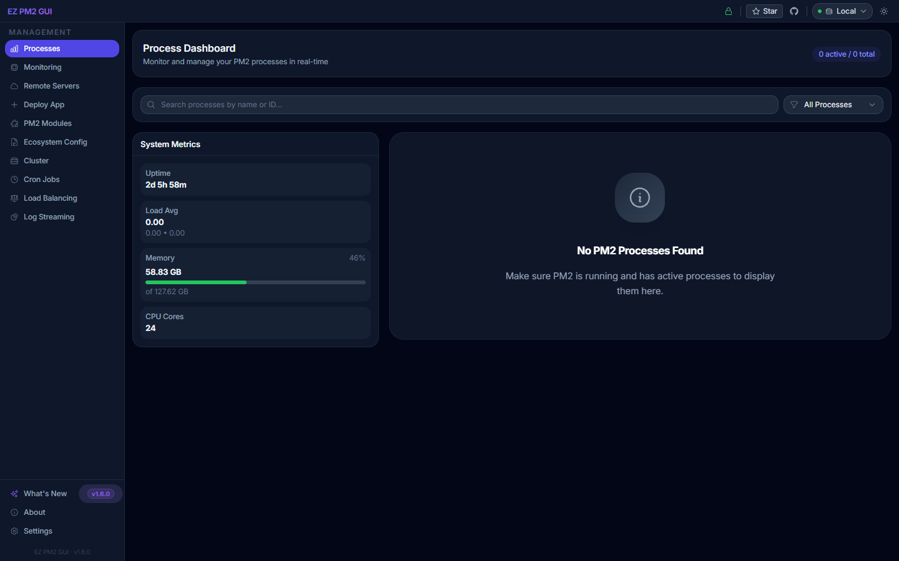
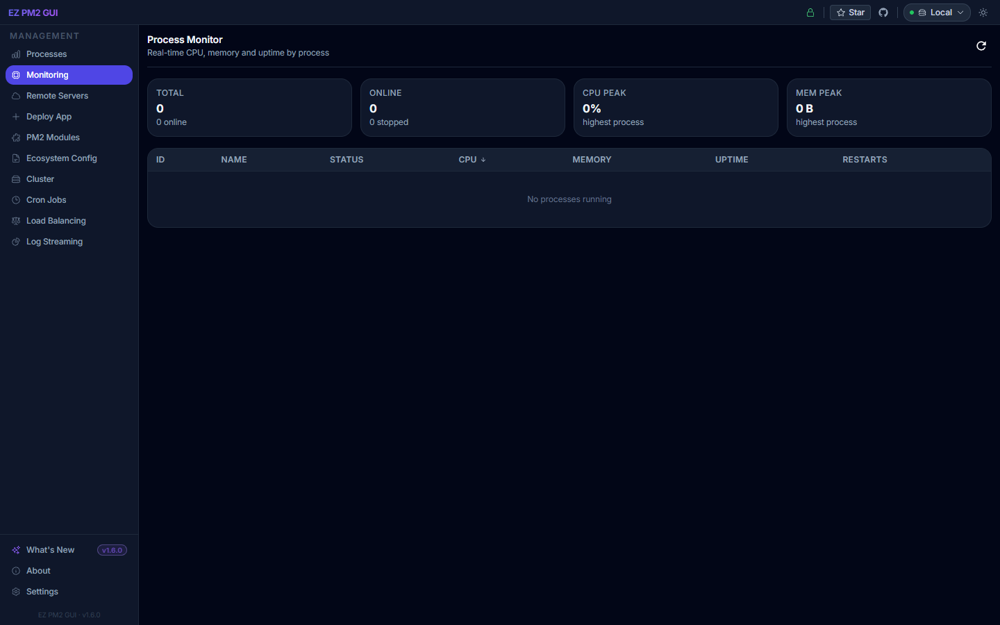
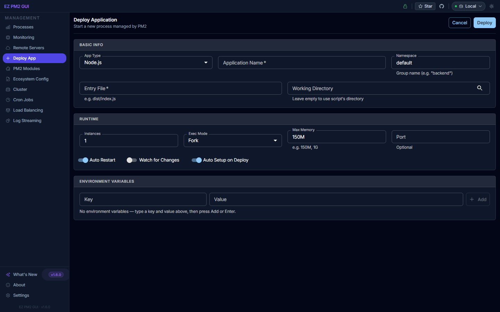
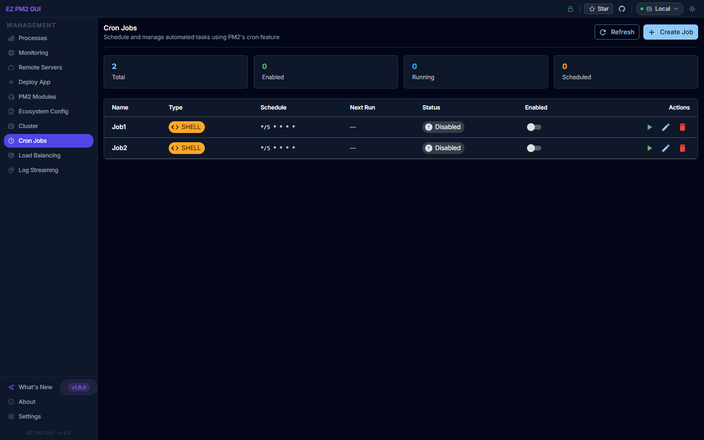
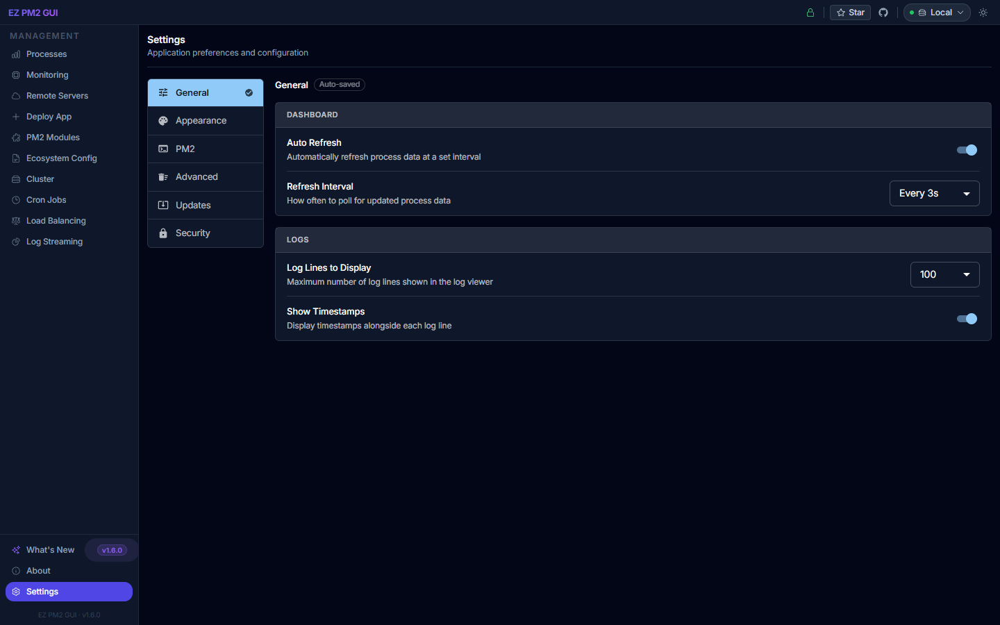

# EZ PM2 GUI

A modern web-based graphical user interface for the PM2 process manager, built with TypeScript, Tailwind CSS, and React.

## Screenshots

**Process Dashboard** — live system metrics and every PM2 process at a glance:



**Monitoring** — real-time CPU, memory and uptime per process:



**Deploy App** — start new PM2 processes from a structured form:



**Cron Jobs** — schedule recurring tasks without touching crontab:



**Settings** — auto-saved preferences for refresh, logs, theme and security:



> See the full visual walkthrough in [https://ezpm2gui.vercel.app/](https://ezpm2gui.vercel.app/) — every screen is annotated with a screenshot.

## Features

- **Real-time process monitoring** - Keep track of all your PM2 processes in real-time
- **Process management** - Start, stop, restart, and delete processes with one click
- **System metrics dashboard** - Monitor CPU, memory usage, and uptime
- **Enhanced log streaming** - View and filter logs from multiple processes simultaneously
- **WebSocket for live updates** - Get instant updates without refreshing
- **Process CPU and memory charts** - Visualize performance metrics over time
- **Filter processes by status or name** - Quickly find the processes you need
- **Dark/light mode** - Fully supported across all pages with Tailwind CSS
- **Cluster management** - Easily scale your Node.js applications
- **Application deployment** - Deploy new applications directly from the UI
- **Ecosystem configuration** - Create and manage your PM2 ecosystem files
- **PM2 modules support** - Manage and configure PM2 modules
- **Cron Jobs** - Schedule and manage automated tasks with visual cron expression builder
- **Remote Server Management** - Connect and manage PM2 on remote servers via SSH
- **Advanced Monitoring Dashboard** - Real-time performance charts with health scoring
- **Tailwind CSS UI** - Sleek, compact, and responsive design with consistent dark/light theming
- **Fully typed with TypeScript** - Robust and maintainable codebase

## Detailed Features

### Process Monitoring
Monitor all your PM2 processes in real-time with detailed information on CPU usage, memory consumption, uptime, and status. The intuitive interface makes it easy to identify issues at a glance.

### Remote Server Management
Connect to and manage PM2 processes on remote servers via secure SSH connections:
- Add multiple remote server connections with SSH credentials
- View and manage processes on remote servers
- Stream logs from remote processes in real-time
- Execute PM2 commands on remote machines
- Encrypted credential storage for security

### Cron Jobs
Schedule and automate tasks using PM2's cron restart feature:
- Visual cron expression builder with common presets
- Support for Node.js, Python, Shell, and .NET scripts
- Inline script editor or file-based execution
- Enable/disable jobs without deleting them
- View next execution times and job status

### Advanced Monitoring Dashboard
Get deeper insights into your system and process performance:
- Real-time performance charts for CPU, memory, and load
- System health score calculation
- Historical metrics tracking
- Process alerts for high resource usage
- Per-process performance visualization

### Application Deployment
Deploy new Node.js applications to PM2 directly from the UI. Configure all the necessary options including:
- Application name and script path
- Working directory
- Number of instances for load balancing
- Execution mode (fork or cluster)
- Auto-restart options
- Memory threshold for restarts
- Environment variables

### Cluster Management
Easily scale your Node.js applications with the cluster management interface. Add or remove instances on the fly and switch between fork and cluster execution modes for optimal performance.

### Log Streaming
View and filter logs from multiple processes simultaneously with the enhanced log streaming interface. Features include:
- Real-time log updates via WebSocket
- Filtering by process, log level, or content
- Pausing and resuming log streams
- Download logs for offline analysis
- Floating log panel for remote process logs

### Ecosystem Configuration
Generate and manage PM2 ecosystem configuration files directly from the UI. This makes it easy to set up complex application deployments and share configurations across your team.

### PM2 Modules
Manage and configure PM2 modules to extend the functionality of your PM2 installation. Install, update, and remove modules with a few clicks.

### System Metrics
Monitor key system metrics including:
- CPU usage and number of cores
- Memory usage and availability
- System uptime
- Load averages (1, 5, and 15 minutes)

### User Interface
EZ PM2 GUI uses Tailwind CSS for a sleek, compact, and fully responsive interface:
- Dark and light mode support across all pages
- Consistent color theming with smooth transitions
- Compact layout with small fonts and reduced spacing for information density
- `PageHeader` and `LogStatusBar` reusable components for a consistent look
- Configure dashboard refresh intervals and log display settings from Settings

## Installation

### Global Installation

```bash
npm install -g ezpm2gui
```

### Local Installation

```bash
npm install ezpm2gui
```

## Usage

### As a Command Line Tool (Global Installation)

```bash
# Start the EZ PM2 GUI web interface
ezpm2gui

# Start on a specific port
ezpm2gui --port 4000

# Start bound to all network interfaces
ezpm2gui --host 0.0.0.0

# Generate a sample PM2 ecosystem config
ezpm2gui-generate-ecosystem
```

### As a Module (Local Installation)

```javascript
const ezpm2gui = require('ezpm2gui');

// Start the server with default options
ezpm2gui.start();

// Or with custom options
ezpm2gui.start({
  port: 3030,
  host: '0.0.0.0'
});
```

### Access the UI

Once started, open your browser and navigate to:

```
http://localhost:3001
```

## Requirements

- Node.js 16.x or later
- PM2 installed globally (`npm install -g pm2`)

## Configuration

EZ PM2 GUI uses environment variables for configuration:

- `PORT`: The port to run the server on (default: 3001)
- `HOST`: The host to bind to (default: localhost)

## Load Balancing with PM2

EZ PM2 GUI provides an easy interface to manage PM2's load balancing capabilities:

### Setting Up Load Balancing

1. **Deploy a new application or modify an existing one**: 
   - Set the number of instances to greater than 1 (or 0/-1 for max instances based on CPU cores)
   - Choose "Cluster" as the execution mode for optimal load balancing

2. **Manage your cluster**:
   - Use the Cluster Management section to scale instances up or down
   - Switch between fork and cluster execution modes
   - Reload all instances with zero downtime

### How Load Balancing Works

PM2 provides built-in load balancing when you run your Node.js applications in cluster mode with multiple instances:

- **Cluster Mode**: In this mode, PM2 uses Node.js's cluster module to create multiple worker processes that share the same server port
- **Multiple Instances**: Incoming requests are automatically distributed across your instances
- **Zero Downtime Reloads**: When updating your application, PM2 can reload instances one by one to avoid downtime

### Best Practices

- For CPU-intensive applications, use a number of instances equal to the number of CPU cores
- For I/O-intensive applications, you can use more instances than CPU cores
- Always use cluster mode for load balancing to ensure port sharing between instances
- Use the reload feature instead of restart for zero-downtime deployments

## Development

See [DEVELOPMENT.md](DEVELOPMENT.md) for detailed development instructions.

```bash
# Clone the repository
git clone https://github.com/thechandanbhagat/ezpm2gui.git
cd ezpm2gui

# Install dependencies and build
./install.sh   # On Linux/macOS
install.bat    # On Windows

# Start in development mode
npm run dev

# Build the application
npm run build

# Start the application (production mode)
npm start
```

### Project Structure

```
ezpm2gui/
├── bin/                 # CLI entry points
├── dist/                # Compiled output
├── docs/                # Documentation
├── screenshots/         # Application screenshots
├── scripts/             # Build and utility scripts
├── src/                 # Source code
│   ├── client/          # React frontend
│   │   ├── public/      # Static assets
│   │   └── src/         # React components and logic
│   │       ├── components/ # UI components
│   │       └── types/   # TypeScript types for client
│   ├── server/          # Express backend
│   │   ├── routes/      # API routes
│   │   └── utils/       # Server utilities
│   └── types/           # Shared TypeScript types
└── test/                # Test files
```

## Contributing

Contributions are welcome! Please feel free to submit a Pull Request.

1. Fork the repository
2. Create your feature branch (`git checkout -b feature/amazing-feature`)
3. Make your changes
4. Run the tests to ensure everything works
5. Commit your changes using our [commit guidelines](./docs/COMMIT_GUIDE.md)
6. Push to the branch (`git push origin feature/amazing-feature`)
7. Open a Pull Request

### Coding Style

This project follows standardized TypeScript conventions and uses ESLint for code quality. Before submitting a pull request, please ensure your code follows these guidelines by running:

```bash
npm run lint
```

## FAQ

### Q: How does EZ PM2 GUI differ from pm2-gui and PM2 Plus?

A: EZ PM2 GUI is a modern, TypeScript-based alternative to pm2-gui with a more user-friendly interface and additional features. Unlike PM2 Plus, it's completely free and open-source, running locally on your server rather than in the cloud.

### Q: Can I use EZ PM2 GUI with PM2 running on a different machine?

A: Yes, you can configure EZ PM2 GUI to connect to a remote PM2 installation. You'll need to specify the connection details in the application settings.

### Q: How do I generate an ecosystem file from my existing processes?

A: Use the `ezpm2gui-generate-ecosystem` command-line tool, or visit the Ecosystem Config section in the web UI.

### Q: Can EZ PM2 GUI handle a large number of processes?

A: Yes, EZ PM2 GUI is designed to handle dozens of processes efficiently. The UI is optimized to present large amounts of information in a digestible format.

### Q: Is EZ PM2 GUI secure?

A: By default, EZ PM2 GUI binds to localhost for security reasons. If you expose the interface to other machines, consider adding authentication through a reverse proxy like Nginx.

## Related Projects

- [PM2](https://github.com/Unitech/pm2) - The process manager that EZ PM2 GUI works with
- [pm2-gui](https://github.com/Tjatse/pm2-gui) - The original inspiration for this project

## License

GNU Affero General Public License v3.0 or later (AGPL-3.0-or-later). See [LICENSE](LICENSE).

EZ PM2 GUI interfaces with [PM2](https://github.com/Unitech/pm2), which is licensed under AGPL-3.0. Because this project links PM2 as a library, it is distributed under the same license.

## Credits

Built by [Chandan Bhagat](https://github.com/thechandanbhagat) as a modern alternative to pm2-gui.

---

**Note**: EZ PM2 GUI is not officially affiliated with PM2 or PM2 Plus. It's an independent tool that interfaces with the PM2 process manager.
