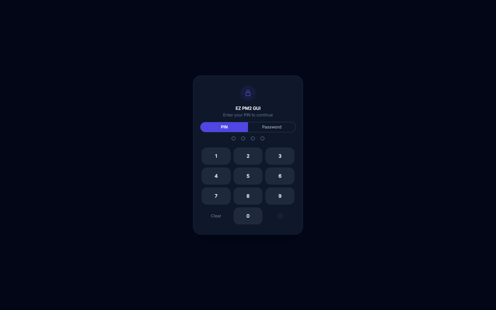
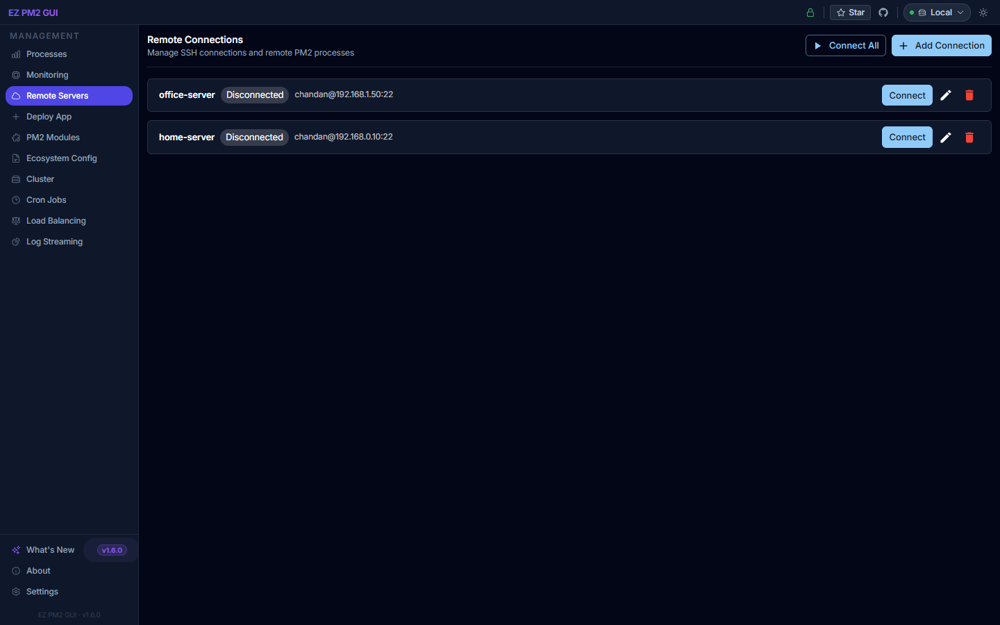
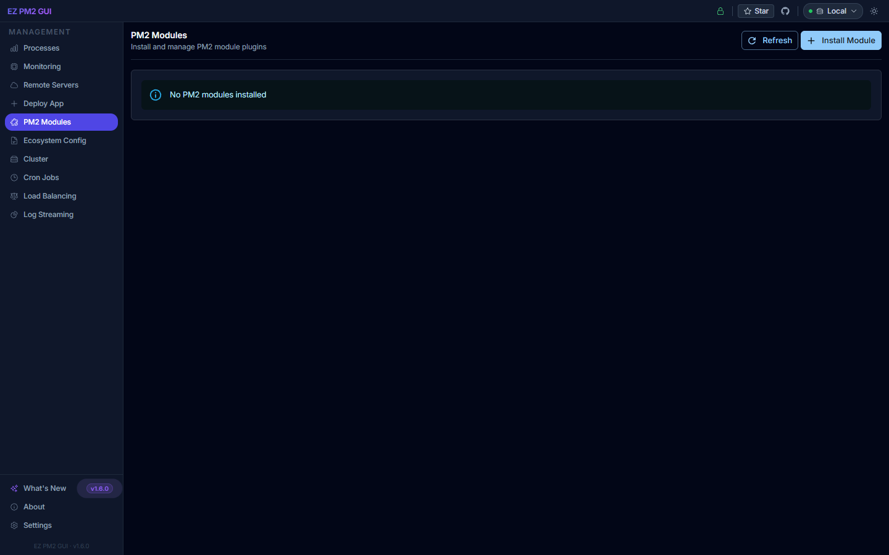
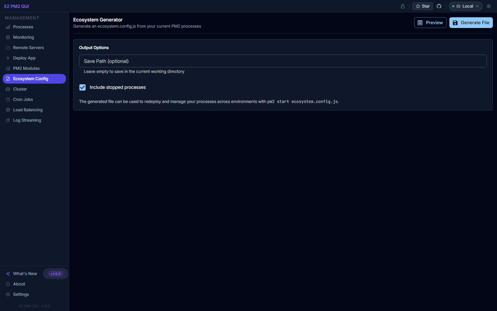
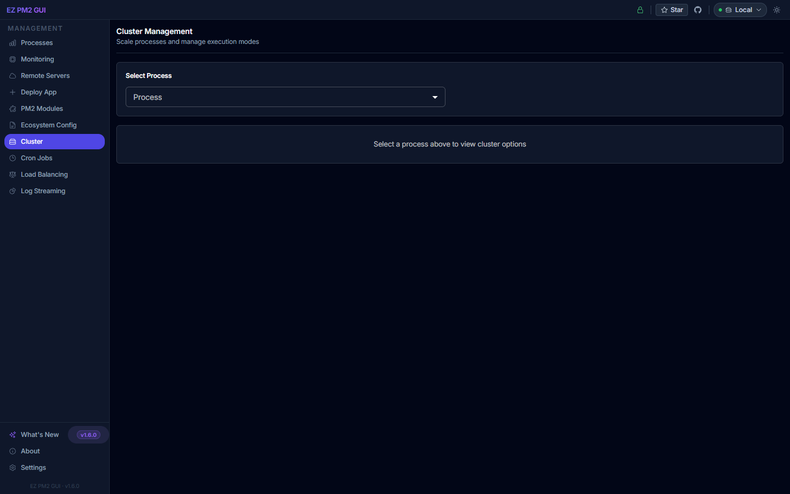
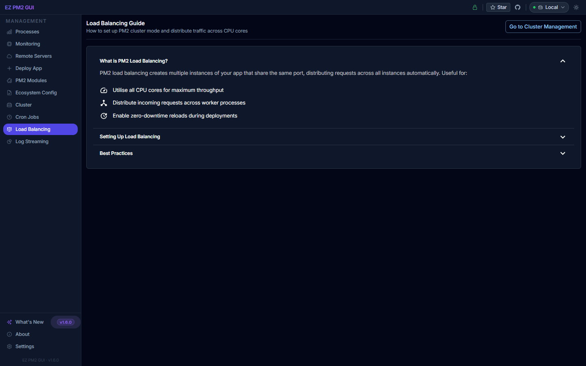
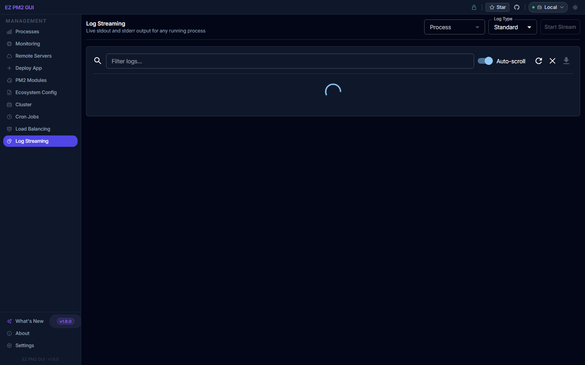

# EZ PM2 GUI — User Guide

A modern web dashboard for [PM2](https://pm2.keymetrics.io/). This guide walks through every screen with a screenshot and a short description of what you can do there.

All screenshots are captured at 1440×900 against the local development server (`http://localhost:3100`).

---

## Table of Contents

1. [Sign In / Lock Screen](#sign-in--lock-screen)
2. [Processes (Dashboard)](#processes-dashboard)
3. [Monitoring](#monitoring)
4. [Remote Servers](#remote-servers)
5. [Deploy App](#deploy-app)
6. [PM2 Modules](#pm2-modules)
7. [Ecosystem Config](#ecosystem-config)
8. [Cluster](#cluster)
9. [Cron Jobs](#cron-jobs)
10. [Load Balancing](#load-balancing)
11. [Log Streaming](#log-streaming)
12. [Settings](#settings)

---

## Sign In / Lock Screen

When you open EZ PM2 GUI, the lock screen appears first.

- **PIN tab** — enter a 4-digit PIN using the on-screen keypad or your keyboard.
- **Password tab** — switch to password entry if a password was configured.
- The app auto-submits once the full PIN is entered.
- An idle session auto-locks after the configured timeout (default 5 minutes — see [Settings → Security](#settings)).

---

## Processes (Dashboard)

The default landing page. Shows live system health plus every PM2 process.

- **System Metrics card** — uptime, load average, host memory usage, CPU core count.
- **Search bar** — filter processes by name or ID.
- **All Processes dropdown** — filter by status or namespace.
- **Active / total counter** — top-right summary of online vs. stopped processes.
- Empty state message appears when PM2 has no registered processes.

---

## Monitoring

Real-time CPU, memory and uptime per process.

- **Summary cards** — total, online (vs. stopped), CPU peak, memory peak with the "highest process" label.
- **Sortable table** — columns for ID, Name, Status, CPU, Memory, Uptime and Restarts.
- **Refresh icon (top-right)** — manually trigger a data refresh.
- Rows update live over the socket connection.

---

## Remote Servers

Manage PM2 instances on other machines over SSH.

- Add a remote host (hostname, user, SSH key/password).
- Switch between **Local** and remote servers using the top-right server selector.
- All dashboard tabs then operate against the active remote.

---

## Deploy App

Start a new PM2 process without dropping to a terminal.

- **Basic Info** — App Type (Node.js, Python, Bash, etc.), Application Name, Namespace, Entry File, Working Directory.
- **Runtime** — Instances, Exec Mode (Fork / Cluster), Max Memory, Port, Auto Restart, Watch for Changes, Auto Setup on Deploy toggles.
- **Environment Variables** — add key/value pairs individually.
- **Deploy** / **Cancel** buttons in the header.

---

## PM2 Modules

Install and manage official and community PM2 modules (`pm2 install <module>`).

- Browse popular modules (logrotate, server-monit, etc.).
- Install / uninstall / enable / disable from one place.
- View each module's configuration and current status.

---

## Ecosystem Config

Edit, preview and generate your `ecosystem.config.js` file.

- Structured editor for the `apps` array.
- Deploy section for staging/production targets.
- Export the file to disk or copy the generated JavaScript.

---

## Cluster

Scale a process across multiple CPU cores.

- Pick an app, then increase or decrease the instance count.
- Switch Exec Mode between Fork and Cluster.
- View per-instance status for the selected app.

---

## Cron Jobs

Schedule tasks without editing crontab.

- Create a cron entry with a standard cron expression (`* * * * *`).
- Each entry runs a script or PM2 action on schedule.
- Enable / disable / delete entries inline.

---

## Load Balancing

Interactive guide to setting up load balancing with PM2.

- Explanation of cluster mode, sticky sessions, and graceful reload.
- Copyable command snippets for common scenarios.
- Links through to the Cluster page for the action itself.

---

## Log Streaming

Follow stdout and stderr for any process in real time.

- Pick a process from the dropdown.
- Stream is line-buffered via WebSockets.
- Toggle timestamps and tune the line buffer in [Settings → Logs](#settings).

---

## Settings

Application-wide preferences, auto-saved as you change them.

Sections in the left rail:

- **General** — Auto Refresh toggle, Refresh Interval, Log Lines to Display, Show Timestamps.
- **Appearance** — Light / Dark mode and accent.
- **PM2** — daemon/connection options.
- **Advanced** — low-level flags for power users.
- **Updates** — check for a newer `ezpm2gui` npm version.
- **Security** — PIN, password, and auto-lock timeout.

---

## Top Bar (Always Visible)

Across every page the top bar gives you:

- **Lock icon** — lock the app immediately.
- **Star on GitHub** / **GitHub logo** — project repo link.
- **Server selector** (`Local ▾`) — switch between the local daemon and any configured remote.
- **Theme toggle** — light / dark mode.

---

*Generated for ezpm2gui v1.6.0.*
