# EZ PM2 GUI — User Guide

Reviewed against v1.11.4. A practical walkthrough of setup, process management, metrics, logs, and settings.

## Contents

- [Watch the demo](#demo)
- [Getting Started](#getting-started)
- [Processes (Dashboard)](#processes)
- [Process Details](#monitoring)
- [Metrics: Live and History](#metrics)
- [Remote Servers](#remote)
- [Deploy App](#deploy)
- [PM2 Modules](#modules)
- [Ecosystem Config](#ecosystem)
- [Cluster](#cluster)
- [Cron Jobs](#cron)
- [Load Balancing](#load-balancing)
- [Log Streaming](#logs)
- [Settings and Navigation](#settings)
- [Troubleshooting and Data](#faq)

<a id="demo"></a>

## Watch the demo

A 66-second walkthrough of the dashboard, process restart, live metrics, log search, deployment form, and appearance settings, with voiceover and soft background music.

[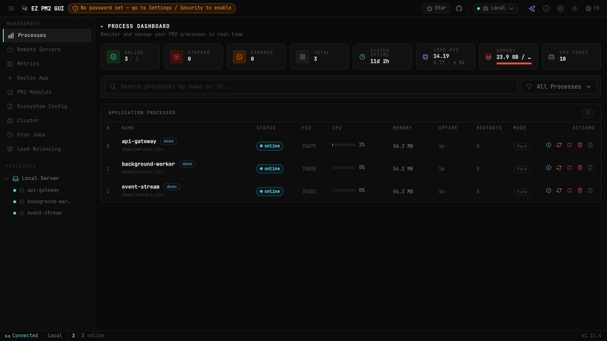](https://youtu.be/u1ckawU-sg4)

[Watch the demo on YouTube](https://youtu.be/u1ckawU-sg4)

Screenshots below show v1.11.4 using three isolated sample processes. The remote-history screenshot shows the real empty state before a remote server is connected; it does not contain simulated history. Example forms are shown before submission.

<a id="getting-started"></a>

## Getting Started

<a id="installation"></a>

### Installation

Use **Node.js 24**, the runtime tested with this checkout. Older Node.js 16/18 instructions do not match the current native SQLite dependency. PM2 must be installed and available on the server process’s **PATH**.

```bash
npm install -g pm2
npm install -g ezpm2gui
ezpm2gui
```

For a local project dependency, run `npm install ezpm2gui` followed by `npx ezpm2gui`. Run the GUI as the same operating-system user, with the same `PM2_HOME`, as the PM2 processes you want to manage.

<a id="first-launch"></a>

### First Launch

1. Open `http://localhost:3101` after the server reports that it is listening.
2. If PM2 has no processes, start an existing application with `pm2 start path/to/app.js --name my-app`. An empty process list is valid; it does not mean the daemon is disconnected.
3. On a fresh installation without a password, the dashboard opens directly. Configure access under **Settings → Security** if required.

<a id="configuration"></a>

### Host, port, and configuration

Configure the server with environment variables. The current CLI does not parse `--port` or `--host` options. The server also reads `.env.local`, then `.env`, from the working directory.

```bash
HOST=127.0.0.1 PORT=3102 ezpm2gui
```

```powershell
$env:HOST="127.0.0.1"
$env:PORT="3102"
ezpm2gui
```

| Variable | Purpose |
| --- | --- |
| HOST | Listen address; defaults to localhost. |
| PORT | Listen port; defaults to 3101. |
| PM2_HOME | Choose the PM2 daemon and process data directory. |
| EZPM2GUI_SECRET | Operator-supplied encryption secret for stored SSH credentials. Keep it stable and back it up separately. |

The production browser client uses the server’s origin. You do not need to rebuild the client just to change the server port. Before exposing the server to other machines, configure authentication and HTTPS access.

<a id="lock-screen"></a>

### Password, PIN, and Lock Screen

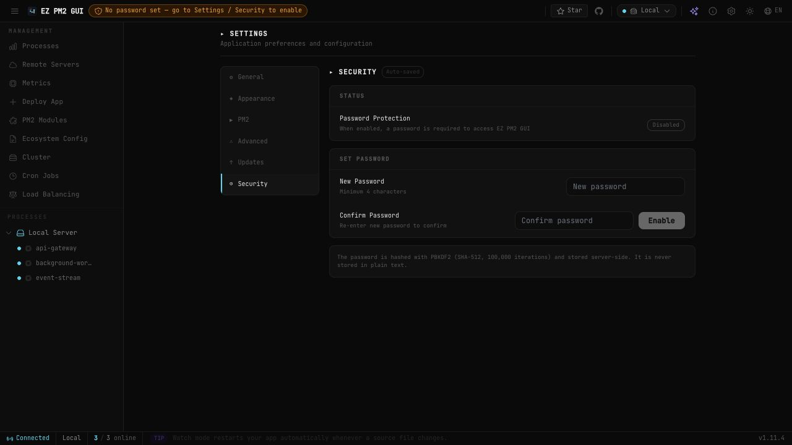

*Settings → Security on a fresh installation, before password protection is enabled.*

1. Enter and confirm a password under **Settings → Security**, then click **Enable**. The current minimum is four characters.
2. After setting a password, optionally add a **four-digit PIN**. A PIN cannot be configured before a password.
3. Use the lock control in the top bar to lock immediately. At the lock screen, enter the password or configured PIN; a complete PIN submits automatically.
4. Choose an idle auto-lock timeout and click **Save**. The default is **0 (disabled)**.

Security changes use their explicit Enable/Save/Remove controls. They are not all auto-saved like appearance preferences.

<a id="docker"></a>

### Run with Docker

Build the image from the repository root. This runs a separate PM2 environment inside the container; mounting a host PM2 folder does not make host processes portable into it.

```bash
docker build -t ezpm2gui:local .
docker run --name ezpm2gui -p 127.0.0.1:3101:3101 \
  -v ezpm2gui-pm2:/app/.pm2 \
  -v ezpm2gui-config:/app/dist/server/config \
  -v ezpm2gui-uploads:/app/uploads \
  ezpm2gui:local
```

The image runs as a non-root user. Application code, runtimes, and writable directories must be available inside the container. Use **Remote Servers** for an existing PM2 installation on another host.

<a id="processes"></a>

## Processes (Dashboard)

Open **Processes** for the active server’s process list. Status cards show online, stopped, errored, and total counts alongside system uptime, load averages, memory, and CPU cores.


*Process dashboard with three running sample services and live resource readings.*

- Search by process **name or ID**. The status dropdown offers All, Online, Stopped, and Errored; namespace appears as a label beside the process name.
- Each row shows status, PID, CPU, memory, uptime, restart count, and execution mode.
- Use **Details**, **Logs**, and the start/stop/restart/delete actions on a row. Read any confirmation before applying it.
- The sidebar groups processes by server. Click a process name for logs; hover a process row for its restart/start and log shortcuts.
- The top bar includes the server selector, security status, What’s New, About, Settings, theme toggle, and the English/Nepali/Chinese language selector.

<a id="monitoring"></a>

## Process Details

Choose **Details** on a process row. The process page combines current resource use, restart count, start time, management controls, and four tabs.

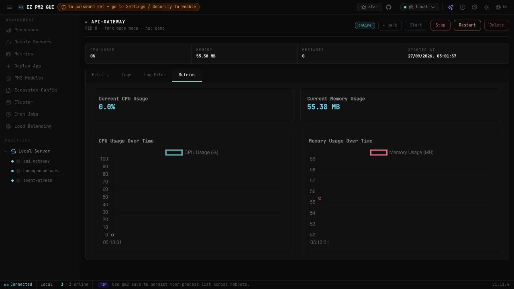

*A sample process’s Metrics tab with current CPU and memory and time-series charts.*

| Tab | What it shows |
| --- | --- |
| Details | Namespace, execution mode, instances, script path, and environment variables. |
| Logs | Process output for diagnosis. |
| Log Files | Browse available log files for the selected process. |
| Metrics | Current CPU and memory with recent performance charts. |

Environment variables can contain credentials, so review them before sharing a screenshot. For the broader monitoring view, use **Metrics** in the sidebar. The current navigation does not have a separate `/monit` page.

<a id="metrics"></a>

## Metrics: Live and History

<a id="metrics-live"></a>

### Live metrics

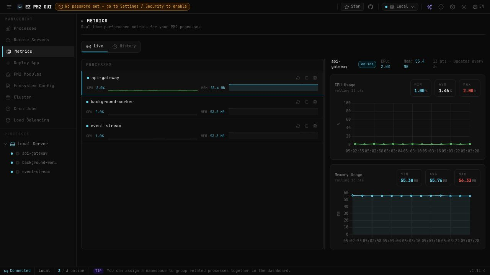

*Metrics → Live: process sparklines on the left, CPU and memory charts for the selected process on the right.*

1. Open **Metrics → Live** and select a process from the left-hand list.
2. Read the CPU and memory charts and their minimum, average, and maximum values. New samples arrive with the live process updates, normally every three seconds.
3. Drag the divider to resize the process list and chart panels.

The live buffer holds up to **1,200 samples**—about one hour at three-second intervals. It builds while this view is open and is not a persisted recording; reopening the page starts a new buffer.

<a id="metrics-history"></a>

### Recorded remote history

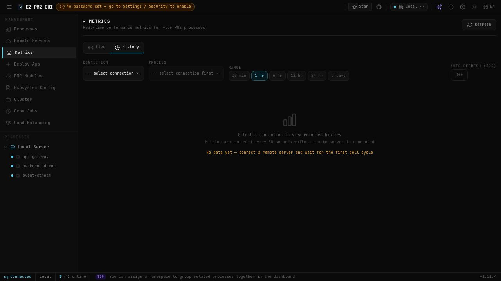

*Metrics → History before a remote connection has recorded its first sample.*

1. Add and connect a server in **Remote Servers**.
2. Keep the GUI server and remote connection running. The background collector records remote process CPU and memory every **30 seconds**.
3. Open **Metrics → History**, choose a **Connection**, then a **Process**.
4. Choose **30 min, 1 hr, 6 hr, 12 hr, 24 hr, or 7 days**. Use **Refresh**, or turn on the separate **Auto-refresh (30s)** control.

Recorded remote history is stored in `remote-metrics.db` under the running server’s config directory. The database prunes samples older than 30 days at startup. Local live samples do not automatically appear in this remote-history selector. A new connection needs a collection cycle before data appears.

<a id="remote"></a>

## Remote Servers

Manage an existing PM2 installation over SSH. The remote host needs SSH access, the required application runtimes, and PM2 available to the SSH user.

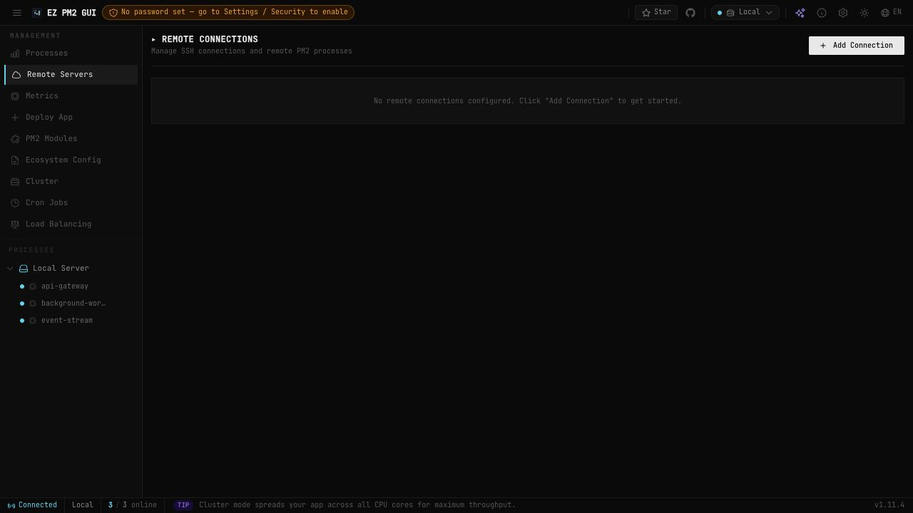

*Remote Connections before adding a host.*

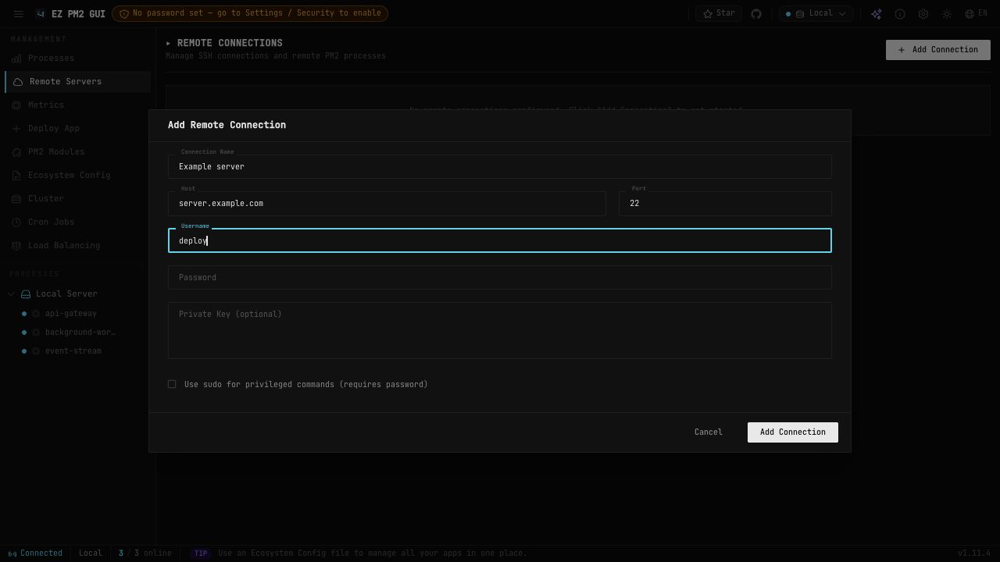

*Add Remote Connection with example host details; no credentials entered or connection submitted.*

1. Click **Add Connection** and provide a friendly name, hostname, SSH port (default 22), and username.
2. Supply a password or paste a private key. Enable sudo only when the remote actions require it and the account supports it.
3. Save the connection, then connect. Follow the PM2 detection/install controls if PM2 is unavailable.
4. Select the connected host in the top-bar server switcher to inspect its dashboard and live metrics. Use its sidebar process entries to open remote logs.

The server selector applies to the process dashboard, process details, live metrics, and remote log routes. **Deploy App, PM2 Modules, Ecosystem Config, Cluster, and Cron Jobs use the local GUI server’s management endpoints** in this version; switching hosts does not redirect all management tools.

Passwords, pasted private keys, and passphrases are stored encrypted on the GUI server using AES-256-CBC. The browser encrypts credential submissions with RSA-OAEP plus AES-256-GCM; the GUI server decrypts them to establish SSH sessions. Set `EZPM2GUI_SECRET` before saving connections. Private keys are stored as encrypted content, not merely referenced by path.

<a id="deploy"></a>

## Deploy App

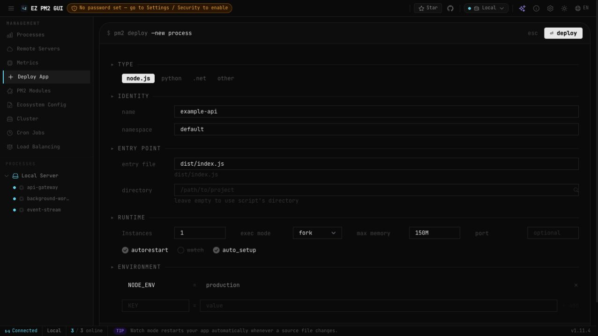

*Deployment form with a sample Node.js application and NODE_ENV variable, before deployment.*

1. Choose **node.js**, **python**, **.net**, or **other** under Type.
2. Enter the application name, optional namespace, entry file, and working directory. Paths refer to the machine running the GUI server, not the browser’s computer.
3. Set instances, fork/cluster execution mode, maximum memory, and port. Review **autorestart**, **watch**, and **auto_setup**.
4. Add environment variables with the key/value fields and **add**. Automatic setup can install dependencies or build the project; review the selected project before enabling it.
5. Click **deploy** when ready, then verify the process status and logs. **esc** leaves the form.

This form starts code already accessible to the server. It does not upload your application from the browser.

<a id="modules"></a>

## PM2 Modules

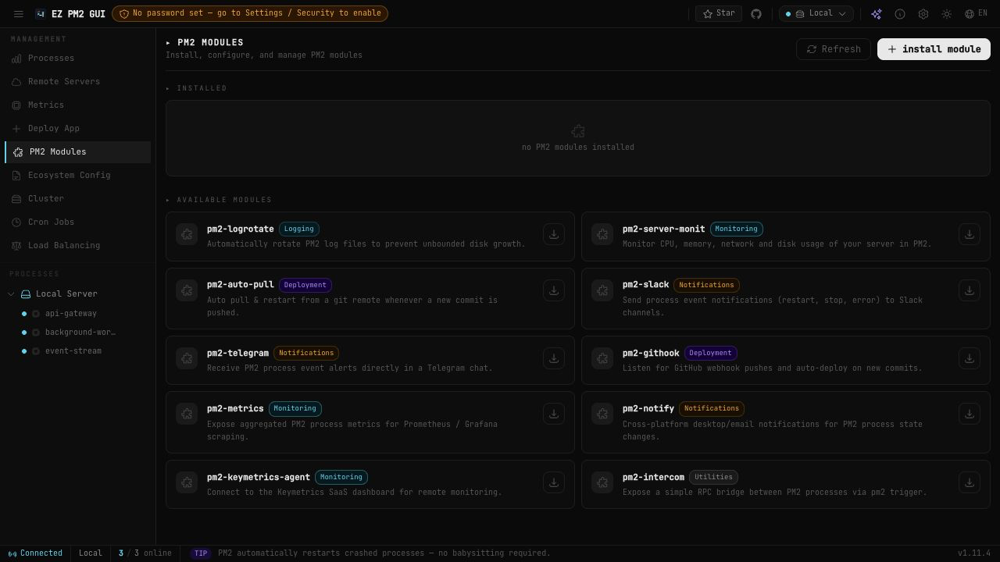

*Installed modules and the available module catalogue.*

- Install a listed module such as `pm2-logrotate`, or use **install module** to enter a package name.
- Installed modules show status and configuration controls. Open the configuration panel, edit values, then save.
- Use **Refresh** to reload the installed list and **Uninstall** to remove a module. The current page does not provide enable/disable toggles.
- Module installation affects the local PM2 environment and may run package installation scripts.

<a id="ecosystem"></a>

## Ecosystem Config

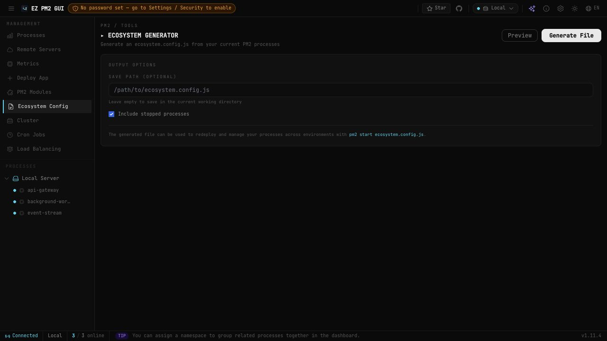

*Ecosystem Generator: output path, stopped-process option, preview, and file generation.*

1. Choose whether to include stopped processes.
2. Click **Preview** to inspect the generated `apps` configuration from the current local PM2 process list.
3. Copy the preview, or set a save path and choose **Generate File** / **Save File**. The output is saved on the server; an empty path uses its working directory.

This is a generator from existing processes, not a structured editor for deployment targets. Review environment values before sharing the resulting file. The CLI command below instead writes a fixed starter example:

```bash
ezpm2gui-generate-ecosystem ecosystem.config.js
pm2 start ecosystem.config.js
```

<a id="cluster"></a>

## Cluster

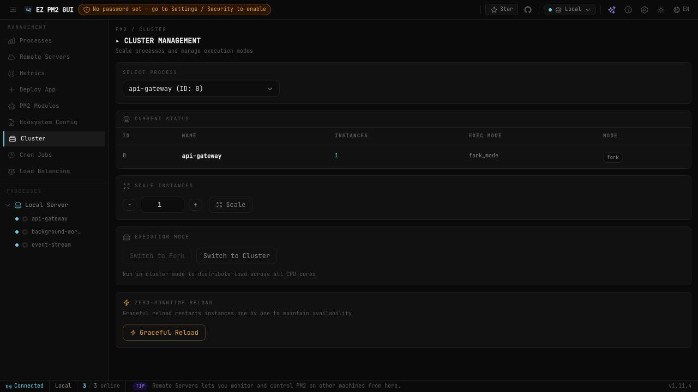

*Cluster controls for the selected sample process; no scale or mode change applied.*

1. Select a local process from the dropdown.
2. Set an instance count with the numeric field or plus/minus buttons, then click **Scale**.
3. Use **Switch to Cluster** or **Switch to Fork** to change execution mode.
4. For a compatible clustered Node.js application, use **Graceful Reload** to replace workers progressively.

Mode changes and scaling affect running processes. A graceful reload still depends on application readiness and shutdown handling; it is not an unconditional guarantee of zero downtime.

<a id="cron"></a>

## Cron Jobs

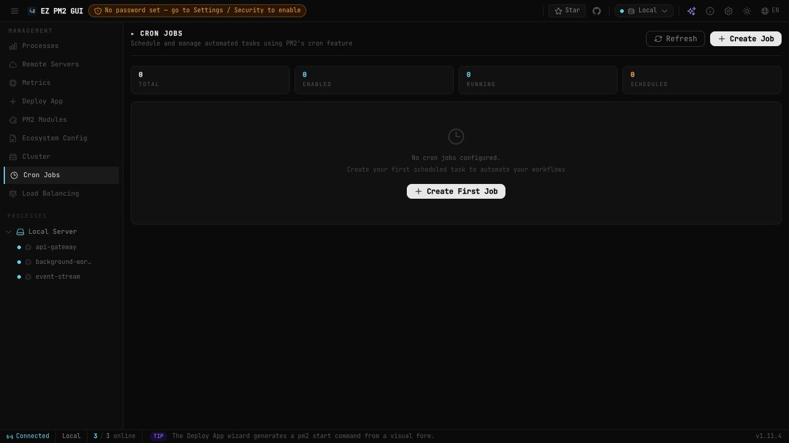

*Cron Jobs before creating a scheduled task.*

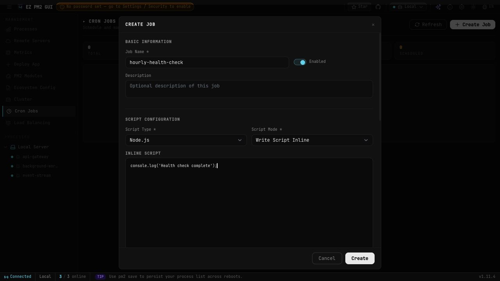

*An unsaved Node.js job showing its name, script type, and inline script editor.*

1. Choose **Create Job**, name the task, and choose whether it is enabled.
2. Choose Node.js, Python, Shell Script, or .NET, then an inline script or an existing script file.
3. Pick a schedule preset or edit the five fields: **minute hour day-of-month month day-of-week**. `0 * * * *` runs hourly; `*/5 * * * *` runs every five minutes.
4. Review the next-run preview, arguments, and environment variables, then create the job.
5. Use the job list to enable/disable, start/stop, edit, or delete a task. Inspect its associated PM2 process logs for output.

The server stores job definitions and configures PM2 with `cron_restart` and `autorestart: false`. Creating or enabling a job starts its PM2 process, so it can execute immediately as well as on the cron schedule. Scripts run with the GUI server’s OS permissions and should exit when complete. The page does not provide a separate per-execution results archive.

<a id="load-balancing"></a>

## Load Balancing

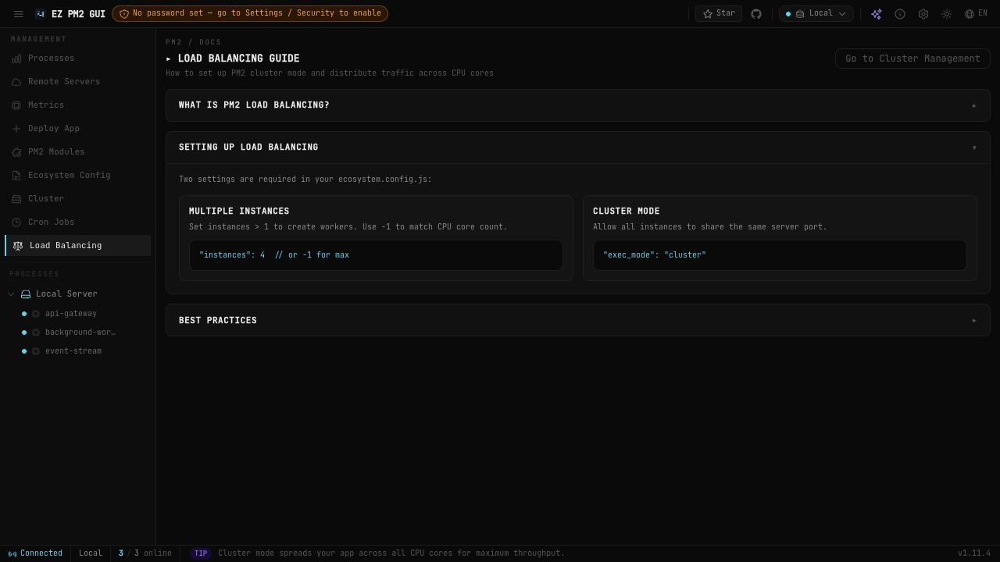

*The in-app guide’s setup section showing multiple instances and cluster mode.*

Expand the explanations and setup examples, then use **Go to Cluster Management** for the controls. Node.js cluster workers share a listening port. Choose a worker count appropriate to available CPU and memory, and test how the application handles sessions and graceful shutdown.

<a id="logs"></a>

## Log Streaming

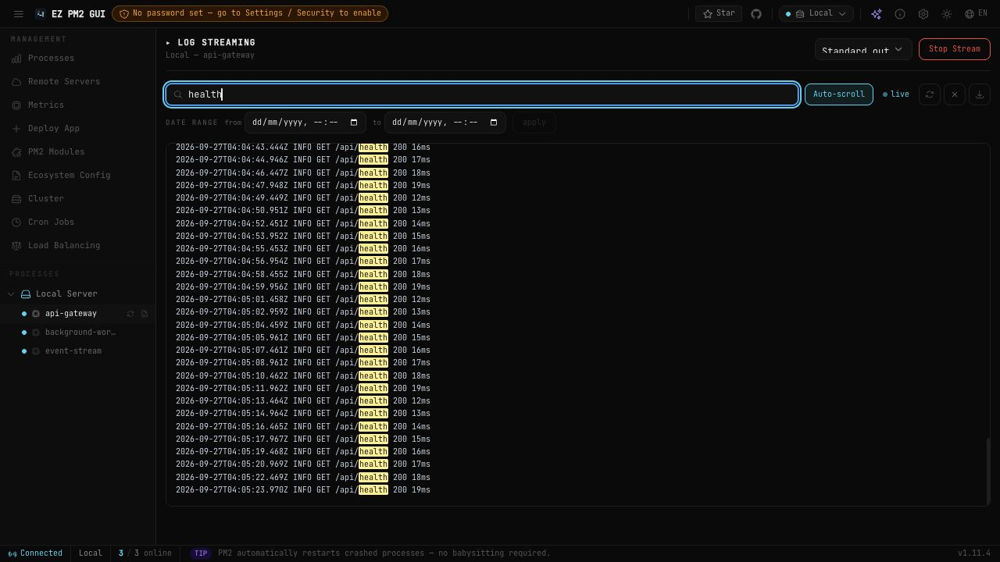

*Live stdout from api-gateway with matching health-check text highlighted.*

1. Click a process in the sidebar, or its **Logs** action in the process table.
2. Select **Standard out** or **Standard err**. Local logs stream over the socket; remote log views refresh through remote polling.
3. Use **Filter logs…** to narrow and highlight matching text. **Stop Stream**, **Auto-scroll**, and **Refresh** control the view.
4. Enter a **from** and/or **to** timestamp and click **apply** to view a historical snapshot. Incoming live updates pause while the range filter is active; clear the range to return to live output.
5. Use **Download** to save the loaded log text. **Clear** clears the viewer; it does not delete the log file on disk.

Date filtering needs timestamps that the viewer can parse. Lines without a timestamp inherit the preceding timestamp for multiline entries. If logs are missing, check PM2’s stdout/stderr paths and the GUI server’s file permissions.

<a id="settings"></a>

## Settings and Navigation

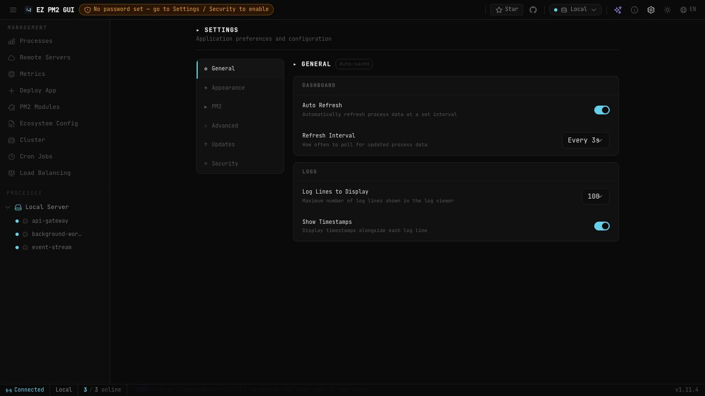

*General preferences: refresh controls, log line count, and timestamps.*

Most display preferences save in this browser. Security settings and updates use their own action buttons; they are not covered by the general auto-save label.

| Section | Controls and behavior |
| --- | --- |
| General | Auto refresh, interval, log line count (50–1000), and timestamp display. |
| Appearance | Compact mode and accent colour. Theme is toggled in the top bar. |
| PM2 | A PM2 Path preference is saved locally. The backend still needs pm2 on its PATH; this preference does not repair a missing server executable. |
| Advanced | Reset preferences or clear browser local storage. |
| Updates | Check, install, and restart controls with installation output. |
| Security | Enable/change/remove password, optional PIN, and idle auto-lock timeout. |

<a id="theme"></a>

### Appearance and language

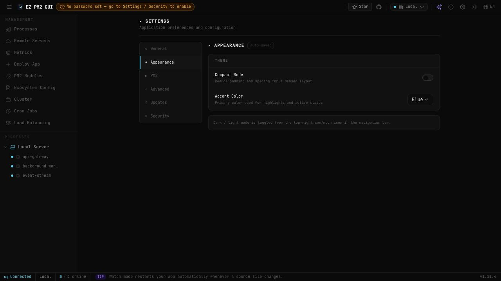

*Appearance controls for compact mode and accent colour.*

Use the top-bar sun/moon button for light or dark mode. The language button switches between **English, Nepali, and Chinese**. Preferences persist in the browser. **What’s New** shows release notes; **About** identifies the application version.

<a id="updates"></a>

### Checking for Updates

Open **Settings → Updates** and click **Check for Updates**. If a newer package is available, use the install control and review the streamed output. Installation runs `npm install -g ezpm2gui@latest`, so the server user needs the appropriate npm permissions. Restart after a successful update. For a source checkout or container, rebuild/redeploy that installation instead of assuming a global npm update replaces it.

<a id="faq"></a>

## Troubleshooting and Data

<a id="empty-processes"></a>

### The process list is empty

Run `pm2 list` in the same OS account and with the same `PM2_HOME` as the GUI server. Check the active server selector. A connected daemon can legitimately have zero processes.

<a id="pm2-not-found"></a>

### PM2 is not installed or not connected

Verify `pm2 --version` works in the server’s environment. Check its PATH, daemon access, directory permissions, and server logs. When running under a service manager, its PATH may differ from your interactive shell. The Settings → PM2 field alone does not change the backend PATH.

<a id="empty-history"></a>

### History has no data

Connect a remote server and allow at least one 30-second collection cycle. Choose a connection, process, and a range covering the collection time. Local Live graphs are separate from stored remote history.

<a id="remote-pm2"></a>

### Remote PM2 is not found

Verify SSH access and run `pm2 list` as the configured remote user. Ensure Node.js and PM2 are available in that user’s SSH environment; use the remote installation controls only if you intend to install PM2 there.

<a id="runtime-errors"></a>

### SQLite or startup errors

Use Node.js 24 for this checkout. After changing Node versions, reinstall dependencies so the native SQLite module matches the runtime. For source builds, run `npm ci`, `npm test`, and `npm run build`, then `npm start`. Confirm that port 3101 is free or set `PORT`.

<a id="data-files"></a>

### Where data is stored

Paths are relative to the running server code: **dist/server/config/** for a built/global installation, or **src/server/config/** when running the TypeScript development server. Preserve this directory when updating or moving an installation.

| File | Purpose |
| --- | --- |
| auth.json | Password/PIN hashes and auto-lock settings. |
| remote-connections.json | Remote host settings and encrypted credentials. |
| project-configs.json | Project setup configuration. |
| cron-jobs.json and cron-scripts/ | Scheduled task definitions and inline script files. |
| remote-metrics.db | SQLite history of connected remote processes. |

PM2 process state and process logs live under the selected `PM2_HOME`. Browser preferences are stored in local storage. Back up the server config, PM2 data, and `EZPM2GUI_SECRET` together before migrations; changing the secret can prevent saved credentials from decrypting.

<a id="service"></a>

### Running as a service

Configure a service manager to launch the installed CLI or built server as the intended PM2 user. Set its working directory, PATH, HOST, PORT, PM2_HOME, and encryption secret explicitly. Confirm the foreground command works before enabling automatic startup.
